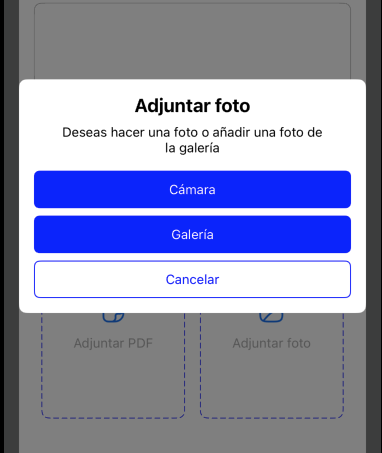

# DHLFourButtonsModal
Custom views to upload and view photos and PDFs.


## Preview


## Installation

### CocoaPods

```ruby
pod 'DHLFourButtonsModal'
```

## Quick Start

### UIKit

```swift
let fourButtonsModal = DHLFourButtonsModal(frame: .zero)
fourButtonsModal.translatesAutoresizingMaskIntoConstraints = false

if let parent = self.parent?.view {
    
    parent.addSubview(fourButtonsModal)
    
    NSLayoutConstraint.activate([
        fourButtonsModal.topAnchor.constraint(equalTo: parent.topAnchor),
        fourButtonsModal.bottomAnchor.constraint(equalTo: parent.bottomAnchor),
        fourButtonsModal.leadingAnchor.constraint(equalTo: parent.leadingAnchor),
        fourButtonsModal.trailingAnchor.constraint(equalTo: parent.trailingAnchor)
    ])
}

fourButtonsModal.setUp(
    title: NSLocalizedString("delete_photo_title", tableName: "Strings", bundle: Bundle(for: DHLUploadPhotoView.self), comment: ""),
    subtitle: NSLocalizedString("delete_photo_description", tableName: "Strings", bundle: Bundle(for: DHLUploadPhotoView.self), comment: ""),
    first: NSLocalizedString("delete", tableName: "Strings", bundle: Bundle(for: DHLUploadPhotoView.self), comment: ""),
    firstAction: {
        documentViewerView.removeFromSuperview()
        fourButtonsModal.removeFromSuperview()
        deleteAction()
    },
    second: NSLocalizedString("cancel", tableName: "Strings", bundle: Bundle(for: DHLUploadPhotoView.self), comment: ""),
    secondAction: {
        fourButtonsModal.removeFromSuperview()
    },
    secondButtonReserveColor: true
)
```
